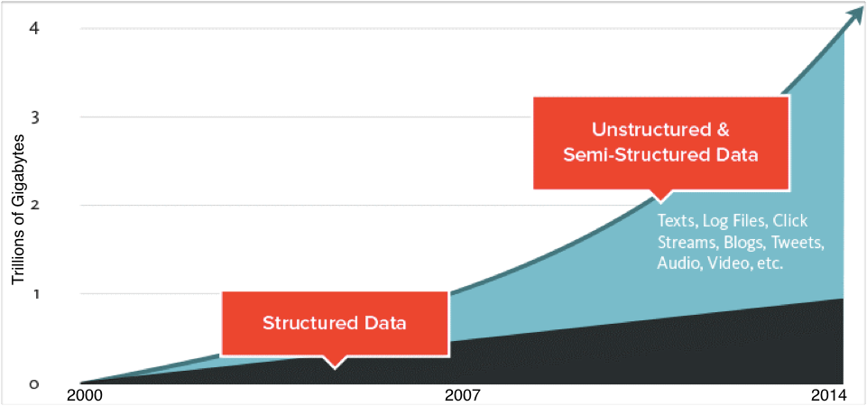

# Introduction to Data Science

### Welcome

Congratulations on signing up for  Flatiron School's Data Science Bootcamp Prep course on Learn.co. You’re in the right place to begin learning key foundational skills data scientists use every day.

### Why Data Science

Simply put, data science is where it’s at.

The amount of captured data is increasing each year, and data scientists like us will be needed to collect and interpret this data.

As such, more companies are looking for data scientists who have the necessary skills to collect this information and turn them into meaningful insights.

Take a look at the chart above from indeed.com. In 2017, there were five times the number of data science job postings as there were three years earlier. 
And it's not just businesses that are seeking to employ positions in data science.

* In 2015, forty percent of federal agencies had a chief data officer.
* Data science has been used to forecast episodes of civil unrest and detect outbreaks of health crises like Ebola.

### What is data science?

For our purposes, data science involves the following fields: programming, machine learning or statistical algorithms, and business intelligence.

Let's see this as a venn diagram:

You can see from this diagram that data scientists need a range of skills. Let’s break those skills down a bit and review how they work together:

** Programming Skills** -- to collect data, we need programming or coding skills to gather it. 
** Business Intelligence ** -- to explore the data, we need a background in the data we are reviewing to provide context on how best to organize it. 
** Math & Statistics Knowledge ** -- to make predictions with the data, we need to use statistics and machine learning to build a model.

This course will teach you the necessary programming skills in Python, as well as the math and statistical skills you’ll need to build prediction models. 

Ultimately, Business Intelligence will be determined by the job, industry, agency, or area of expertise you’ll be hired into as a data scientist. For the purposes of this course though, we’ll walk you through the background of a given project and describe what we’re aiming to solve. 

In the process, we’ll explore a number of different subject areas (music, movies, even New York City taxi data!) giving you real-world practice so you can leverage data science as a skill for any organization capturing data.

### Next Up

As a Flatiron School course, we designed the course to provide the following: 

**1. Practice with Theory**

*Practice*: The course is written to give you the skills to become a successful data scientist.  To do that, we have you code in Python every step of the way.  And we teach you techniques that practitioners use every step of the way.

*Theory*:  But your knowledge of data science should not end with this course.  The field of data science will continue to evolve, and you'll need to understand the reasoning and shifts in the future.  For that, we need you to reach to the reasoning behind the techniques, and yes that includes the underlying mathematics. 

**2. Accessible **

This course was designed to be accessible to everyone. 

*Math is a four letter word*:  Listen up, we do not expect you to walk in here a math person.  We know that the just the word *math* provokes fear and boredom -- somehow simultaneously!  Still, we won't shy away from it.  Chances are you learned math through pencil and paper, not through programming graphs and equations that automatically respond to your inputs.  It's time to give it a honest try.

*Computer Science is a liberal art*.  We also don't expect you to have any knowledge of programming.  We'll get you there, and show you how to use it to make sense of data.

**3. Fall in Love **

Finally, we know that the best way to teach a subject is to get you to fall in love with it.  So that's why we make sure to show you the power of each new skill you are learning, and the rich ideas underneath each new concept.  And it's why we have you code on our Learn platform that allows you to tap into the broader community of learners.

### Dive in 

Next up, we'll take a tour of the Python skills we will be utilizing as a data scientist.  Our overall recommendation is to stick with it. You’ve already done the hardest part of getting started. Log in here each day and you’ll be amazed at how quickly you’ll make progress towards becoming a data scientist.
